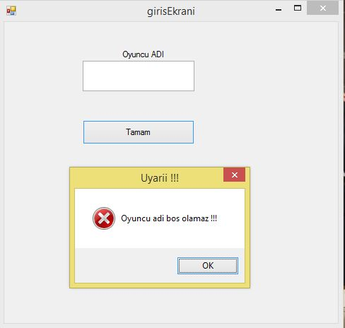
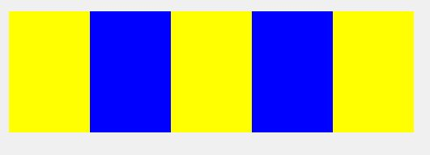
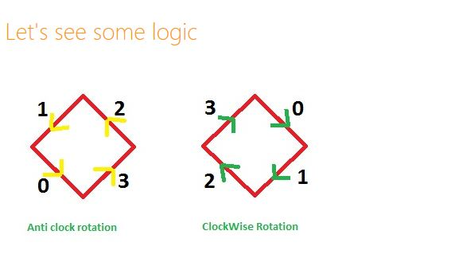
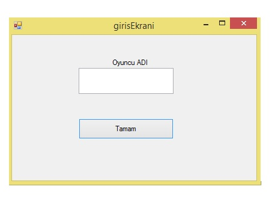
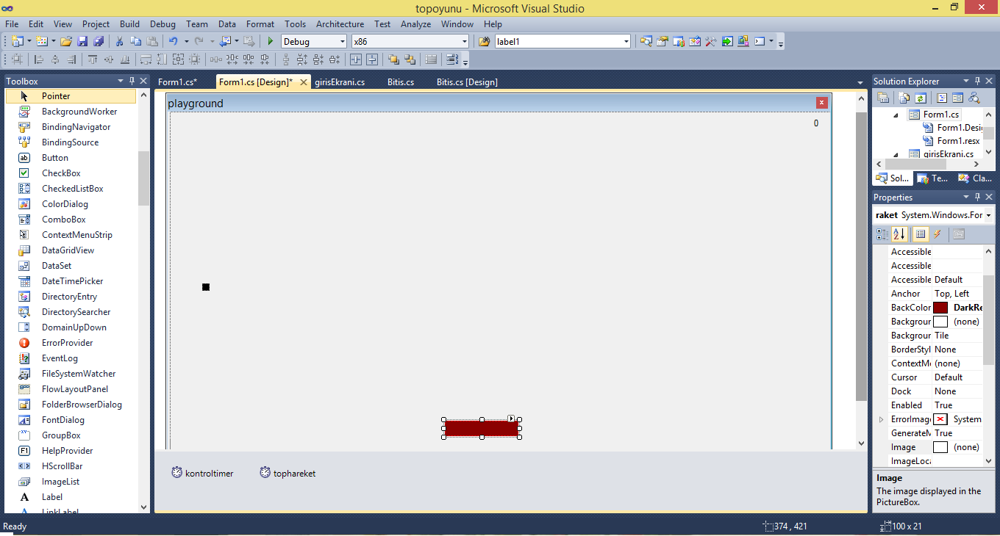
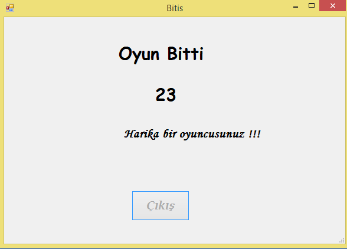
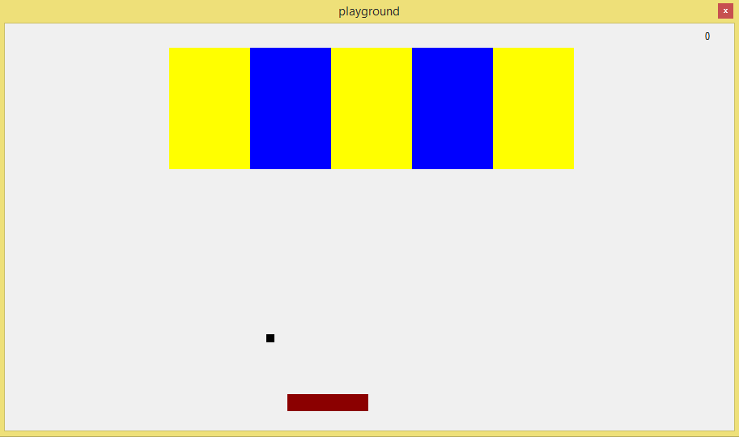
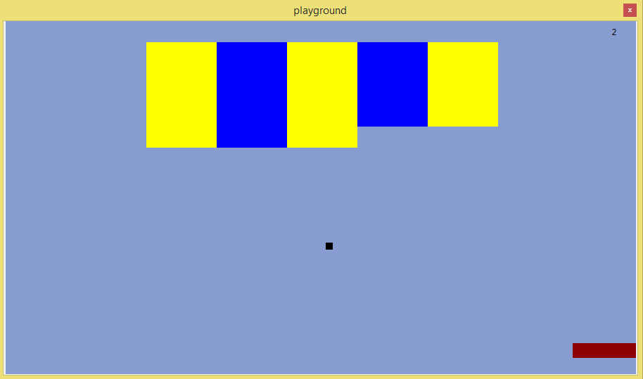

# 
BM299 Staj Raporu 
 

# İçindekiler Tablosu

1. [Giriş](#giris)
2. [Şirket Hakkında Bilgi](#sirket)
3. [Projenin ve Yapılacak olan İşin Tanımı](#proje-tanimi)
	3.1 [Yapılan İş](#yapilanis)
	3.2 [Amaç](#amac)
	3.3 [Tanım](#tanim)  
  3.4 [Süreç ve İşleyiş](#surec)
4. [Proje](#proje)
  4.1 [Amaç](#projeamaci)
	4.2 [Tanım](#projetanimi)
	4.3 [Gereksinimler ve İhtiyaçlar](#gereksinimler)
  4.4 [Analiz](#analiz)
  4.5 [Gelişim Süreci](#gelisimsureci)
  4.6 [Test ve Uygulama](#testveuygulama)
  4.7 [Proje Sonucu](#projesonucu) 
5. [Sonuç](#sonuc)
6. [Kaynaklar](#kaynaklar)
 

## 1.  Giriş  
 
BM 299 1. Staj ‘in konusu : C#.net programlama dili ile masaüstü (desktop) programlama gerçekleştirmektir . Yaz stajımı Teknopark’ta **Bilsoft Yazılım Bilgisayar San. Tic. Ltd. Şti** . ‘ nde gerkeçleştirdim .  Yaptığım oyunun (projenin) türü stratejidir . Bu oyunda kişinin keyif alabileceği bir şekilde dikkatini arttırmak , el becerisi sağlamak , göz ve el koordinasyonu geliştirmek amaçlanmıştır .
 

## 2. Şirket Hakkında Bilgi 

BilSoft Yazılım Web yazılım, tasarım, hosting, E-ticaret uygulamaları, internet danışmanlık hizmetleri ve ticari yazılım hizmetleri vermek üzere 2005 yılında kuruldu.

Teknoloji ile rekabetçi şirket olma arasındaki hızla güçlenen bağlantı, işletmeleri gelişen teknolojiye ayak uydurma konusunda değişik konularda yatırımlara yöneltmektedir. Online Otomasyon Sistemleri ve E-Ticaret çözümleri işletmeleri günümüz teknoloji imkanlarıyla buluşturan, rekabetçi firma olma yolunda fark yaratan konulardır.

Firmamız özellikle bu konularda çalışmalarına yoğunlaşmış ve online otomasyon sistemleri hazırlamıştır. Özellikle Okul Web Otomasyon sistemi ile Türkiyede bir ilke imza atmış, okulların internet ortamında yer almasını sağlayacak öğrenci-veli-öğretmen-idareci ilşkilerini güçlendirecek bir sistem hazırlamıştır. Türkiyede 100' ün üzerinde okul tarafından kullanılan bu yazılım büyük ilgi görmüştür.

2006 yılında özellikle web yazılımcılığı üzerinde çalışmalarımızı yoğunlaştırıp 40 kadar firma ve kurumun internet projelerini geliştirdik. Bu kapsamda bir çok e-ticaret sistemi, online takip sistemleri ve üye takip sistemi geliştirdik. Özellikle Memur-Sen ile ortak geliştirdiğimiz Sendika Üye Takip sistemi ile sendikalar için gelişmiş özelliklere sahip web tabanlı bir üye sistemi hazırladık.

2007 yılında faaliyet alanımızı genişleterek ticari yazılımlar hazırladık. Küçük ve orta ölçekli işletmeler için hazırladığımız ticari paket programımız ile cari işlemler, banka, stok, kasa, taksit gibi işlemlerin kolay bir şekilde kullanılması sağlandı. Program otomatik yedekleme ve web destek modülü sayesinde kullanıcılara büyük kolaylıklar sağlamaktadır.

Geliştirdiğimiz bütün bu ürün ve hizmetlerimizin avantajlarının bilincinde olan BilSoft, dengeli büyüme stratejisiyle müşteri memnuniyeti üzerine kurulu çalışma prensiplerinden taviz vermeden hedefleri doğrultusunda ilerlemekte, bu da BilSoft' un sektördeki konumunu gün ve gün güçlendirmektedir.

BilSoft, uyguladığı strateji ile esnek, Değişen müşteri ihtiyaçları ve rekabet koşullarını hızla algılayıp, üretim, satış ve pazarlama stratejilerimizi buna uygun olarak hayata geçirmektedir.

## 3. Projenin ve Yapılacak olan İşin Tanımı 

Staj başlangıcında C# daha iyi bilgi sahibi olmaya çalıştım . İlk iki haftada eğitim videoları izleyerek algoritma geliştirmek amacıyla küçük uygulamalar yaptım .

Üçüncü haftada da bir yandan Cari hesap programları gibi muhasebe programları öğrenirken diğer yandan yaptığım projeye kaynak oluşturabilecek yazılım ve proje bilgilerini elde ettim. Son iki haftada da projeme yardımı dokunabilecek ve insanları geliştirebilecek olan yazılım bilgilerini toparladım ve projeyi tamamladım .

### 3.1 Yapılan İş

 Oyun kişinin kullanıcı bilgisini alarak başlamaktadır . Oyun bittikten sonra gosterilen bir puan tablosuyla sonlanmaktadır. Bu sayede oyunu oynayan kişi ne kadar başarılı olduğunu görebilmektedir . Oyunda sürekli takip edilmek zorunda olan bir top ve ona çarpmasını sağlamak için bir tahtanın yanı sıra bir de değip yok etmek zorunda olduğunuz kutular vardır. Yaptığım proje internet bağlantısı gerektirmeksizin oynanabilen bir uygulamadır .

### 3.2 Amaç
Projenin amacı oyunu oynayan kişilerin el becerilerini ve reflekslerini hızlandırmak  ve vakit geçirmelerini sağlamak eğlencedir .

### 3.3 Tanım

Yazılan program çalıştırıldıktan sonra derleyici tarafından algılanan Sınıf (Class) ve söz dizimi (syntax) hataları yazılımcıya ayrı bir ekranda ayrıntısı ile gösterilir ve yazılımcı bu hata penceresinden hataları tespit ederek kolayca düzeltebilir.

Ayrıca pek çok programcı tarafından kullanılan bir dil olmasından ötürü takıldığımız noktalarda uzman programcılardan yardım almak oldukça kolaydır . C#.net’in sunduğu kolaylıklar, projemi daha kısa sürede bitirmemde rol oynadı. 

### 3.4 Süreç ve İşleyiş

C# ile nasıl masaüstü uygulaması geliştirilir.

Grafiksel kullanıcı arayüzü (GUI – Graphical User Interface) olarak tanımlanır. Windows form uygulamalarını, konsol uygulamalarından ayıran en önemli özelliği de budur. Windows Form uygulaması oluşturmak için Toolbox adı verilen araç kutusundan nesnel araçlar sürükle bırak yöntemi ile kolayca oluşturulabilir. C# özelliklerin hakkında detaylı bilgi sahibi olduktan sonra, projeyi uygulama sürecine geçtim. Tahmin edilen süre içerisinde proje tamamlandı. 

## 4. Proje

Bu aşamadan sonra, projemizin yapılış adımlarını inceleyeceğiz. Sıfırdan bir uygulama yapılış adımlarını bu başlık altında detaylı olarak anlatmaya çalışacağım .

### 4.1 Amaç

Oyunun amacı hepinizin bildiği gibi günün stresini atmak yada can sıkıntısını gidermektir. Oyun insanın dikkatini ve el becerisini arttırmaktadır .  İnsanın gerçek hayatta yapamayacağı aktiviteleri yapmasını sağlar.

### 4.2. Tanım

Oyun insanların sosyal yaşamının büyük bir parçasıdır. Tetris bir bulmaca oyunudur . Birçok oyun konsolunda farklı sürümlerle oynanır (Nintendo , Game boy , Android , IOS) şuan bile geçmişten süregelen tetris oyunu gelmiş geçmiş en çok oynanan altıncı oyundur .

### 4.3. Gereksinimler ve İhtiyaçlar

Projede kullanılan araçlar ve teknolojileri, projeye başlamadan önce yapılan hazırlıkları bu başlık altında inceleyebiliriz. İkinci haftada projenin konusunu belirleyip, internet ortamında gerekli doküman temini ve araştırmasını yaptım. Formların arasında  geçişleri sağlayan kodları kullanılarak  formların arasında ilişkiler kurdum. Geliştirme ortamı olarak **Visual Studio 2013** kullandım. Projenin görselleştirmesini **Visual Studio 6.0** C#  yardımı ile yaptım.

### 4.4.  Analiz

Projeye başlamadan önce gerekli analizler yapıldı. Proje de var olması gereken bileşenler düşünülüp, oyun paneli tasarlandı. Tasarım da göze hoş gelmeyen ayrıntılar giderildi. Sade ve kullanışlı bir tasarım olmasına dikkat edildi. Projenin tamamlanma süresi 2 hafta olarak belirlendi.

### 4.5. Gelişim Süreci

Öncelikle **Visual Studio 2013** de yeni bir  proje **(New Project )**  açtım, ismini **topoyunu** olarak tanımladım. Projeye bir adet panel ekledim, adını **pg** olarak tanımladım. Bir adet **picturebox** ekledim, adını **top** olarak tanımladım. Panelin boyutlarını ayarladım . Bir adet **picturebox** ekledim , adını **raket** olarak tanımladım. Raketin boyutlarını ayarladım ve bir adet label skor göstergesi koydum . Oyuna giriş ekranı koydum . Giriş ekranında kullanıcı adı ve girişi sağlamak için **TAMAM** butonu konuldu . Oyuncu adı girilmediği zaman uyarı veren bir komut yazdım . 

Oyuncu adı girildiği zaman hemen giriş ekranı kapanıp oyun ekranı açılır . 
Oyun ekranı açıldığı zaman mavi- sarı engeller class kullanılarak 5 satır 5 sütun toplam 25 kare olacak şekilde oyun ekranında konuldu .  

Topun hareket yönünü sağlamak için aşağıdaki yöntem kullanıldı :

Eğer top sağ tarafa ve yükarıya giderken sağ duvara çarparsa sola yükarı doğru gitmeye devam eder .  
Eğer top sol tarafa ve yükarıya giderken sol duvara çarparsa sağa yükarı doğru gitmeye devam eder . 
Eğer top sağ tarafa ve aşağıya giderken  rakete çarparsa sağ yükarı doğru gitmeye devam eder .  
Eğer top sol tarafa ve yükarıya giderken  üst duvara çarparsa sola aşağı doğru gitmeye devam eder .   
Eğer top aşağıya giderken  raket ile vurmazsak  oyun sona erip , bitiş ekranı sunulur.  
Engel vurulduğu zaman puan eklenir ve label1 skor puanında bir puan arttış olur ve aynı zamanda panelin arka plan rengi otomatik olarak değişmektedir . 
Bitiş ekranında üç label (label2, label3 ve label4 ) ve bir tane “Çıkış” butonu ekledim . Birinci label’de (label2) otomatik olarak “Oyun Bitti” ekranı gelecek . İkinci label’de  (label3) mevcut skor tablosunda ikinci formun skoru otomatik olarak  label3’e   geçecektir .  
Bir ile on puan arasında skor alanırsa " Amatör bir oyuncusunuz !!! " cümlesi çıkacaktır . 
On ile onaltı arasında bir puan alırsanız " İyi bir oyuncusunuz!!! " cümlesi çıkacaktır .
Onaltı ile yirmi arasında bir puan alırsanız " Harika bir oyuncusunuz!!! " cümlesi çıkacaktır . 
 Bitiş ekranında oyunun sona ermesini gösterip mevcut puanı görülür.  
Ve dilerseniz oyundan “Çıkış” butonuna tıklayarak çıkabilirsiniz . 

### 4.6 Test ve Uygulama

Projenin test aşamalarını mühendis Abdusammet Aktaş yardımı ile yaptık. Hatalı görülen yerler düzeltildi. Projenin çalışmasında herhangi bir sıkıntı yaşanmadı. Geliştirilmesi adına yeni özelliklerin eklenmesi daha sonraya bırakıldı. 

### 4.7 Proje Sonucu

Proje tahmin edilen süre içerisinde tamamlandı.  Elle tutulur bir C# masaüstü uygulaması geliştirildi.  
 
## 5. Sonuç 

 

Sonuç olarak küçük bir oyun uygulaması geliştirmiş oldum .  C# daki kuralları veya kısa yolları kullanarak uygulamada birçok kodu kısa zamanda kullanabilmeyi öğrenmiş oldum . Formların arasındaki geçişleri , farklı türde tasarımları ek olarak renkleri bu uygulamada başarılı bir şekilde ekleme/yazmayı öğrendim.

Kurumsal bir firmada iş tecrübesi edindim. Kendimi yazılım konusunda biraz daha geliştirdim. Ortaya çıkan uygulamanın ön görünümü aşağıdaki gibidir.

<table>
  <tr>
   <td>Giriş Ekranı</td>
    <td>Panel Görünümü  </td>
    </tr>
  <tr>
    <td></td>
     <td></td>
 </tr>
 </table>
 
 <table>
  <tr>
   <td>Bitiş Ekranı ‘nın görünümü </td>
   <td>Oyun başladığı zaman görünüm </td>
    </tr>
  <tr>
    <td></td>
    <td></td>
 </tr>
 </table>
 
<table>
  <tr> 
   <td>Oyun süresinceki görünüm </td>
   <td>Bitiş ekranından görünüm </td>
  </tr>
  <tr> 
    <td></td>
    <td></td>
  </tr>
 </table>
 
 
 

## 6. Kaynaklar

 * https://www.youtube.com/watch?v=gqp1z8KbG6E

 * http://www.codeproject.com/Articles/470039/Brick-Ball-Game-WPF-Csharp-Game
 
 * http://stackoverflow.com/questions/8465675/creating-random-colors-system-drawing-color
 
 * http://www.tutorialspoint.com/csharp/

 * ***Her Yönüyle C# 6.0 , Volkan Aktaş , Kodlab Yayın***
 
